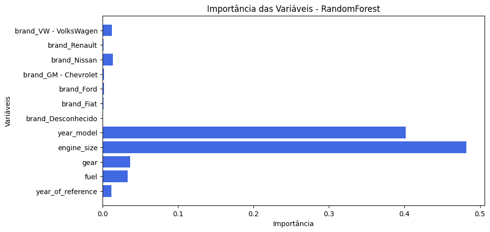
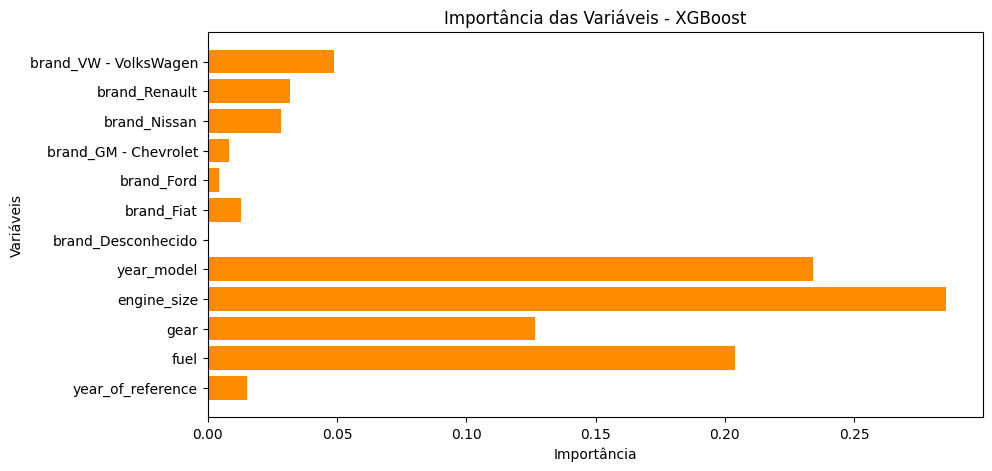

# Análise e Previsão de Preços de Veículos no Brasil

---

## Descrição do Projeto

Este projeto foi desenvolvido em grupo como trabalho para disciplina de Linguagem de Programação Aplicada, do curso de pós-graduação em Inteligência Artificial Aplicada da Universidade Federal do Paraná. Ele tem como objetivo realizar uma análise exploratória detalhada e construir modelos de machine learning para prever os preços médios de carros no mercado brasileiro. Utilizando um conjunto de dados de veículos, exploramos diversas características e aplicamos algoritmos de regressão para identificar os fatores mais influentes na precificação e alcançar a melhor acurácia na previsão.

---

## Participantes do projeto
* Francisco Viana
* Gabriel Godinho
* Guilherme Bilibio
* José Augusto Viana
* Ricardo Monteiro
* Rodrigo Dittmar

## Docente
Prof. Dra. Luani de Oliveira Rosa Piva

---

## Objetivos

* Realizar um pré-processamento e limpeza dos dados, tratando valores ausentes e transformando variáveis.
* Conduzir uma análise exploratória de dados (EDA) para extrair insights sobre a distribuição de preços e a relação entre as características dos veículos.
* Desenvolver e treinar modelos de regressão (RandomForest Regressor e XGBoost Regressor) para prever os preços dos carros.
* Avaliar e comparar o desempenho dos modelos utilizando métricas como Erro Absoluto Médio (MAE), Erro Quadrático Médio (MSE) e Coeficiente de Determinação (R²).
* Identificar as variáveis mais importantes para a determinação do preço dos veículos.

---

## Fontes de Dados

* `precos_carros_brasil.csv`: Dataset principal contendo informações sobre diversos modelos de carros, suas características (marca, modelo, ano, motor, câmbio, combustível, etc.) e preços.
* `metadados.xlsx - metadados.csv`: Arquivo contendo a descrição das colunas presentes no dataset principal, auxiliando no entendimento das variáveis.
* A base original foi extraída do site [Kaggle](https://www.kaggle.com/datasets/vagnerbessa/average-car-prices-bazil/data). A mesma foi adaptada para ser utilizada no presente exercício.

---

## Metodologia

1.  **Instalação e Importação de Bibliotecas:** Configuração do ambiente com as bibliotecas Python necessárias (Pandas, NumPy, Matplotlib, Seaborn, Scikit-learn, XGBoost).
2.  **Carregamento e Inspeção Inicial dos Dados:** Leitura dos datasets e primeira visualização da estrutura e tipos de dados.
3.  **Pré-processamento e Limpeza de Dados:**
    * Tratamento de valores ausentes (utilizando mediana para dados numéricos e moda para categóricos).
    * Remoção de duplicatas.
    * Transformação de variáveis categóricas em numéricas (Label Encoding e One-Hot Encoding).
4.  **Análise Exploratória de Dados (EDA):**
    * Análise estatística descritiva das variáveis.
    * Visualização da distribuição dos preços.
    * Investigação da relação entre preço e outras características como marca, tipo de câmbio, tipo de combustível e ano do modelo.
5.  **Engenharia de Features (se aplicável):**
    * Seleção das features mais relevantes para a modelagem.
6.  **Divisão dos Dados:** Separação do conjunto de dados em treino e teste.
7.  **Treinamento dos Modelos:**
    * RandomForest Regressor
    * XGBoost Regressor
8.  **Avaliação dos Modelos:**
    * Cálculo das métricas MAE, MSE e R² para ambos os modelos no conjunto de teste.
    * Comparação do desempenho para determinar o melhor modelo.
9.  **Análise de Importância das Variáveis:** Identificação das features que mais contribuem para as previsões dos modelos.

---

## Principais Resultados e Conclusões

* **Tratamento de Dados:** Valores faltantes foram tratados com mediana e moda, e não foram encontradas duplicatas após a remoção inicial.
* **Análise Exploratória:**
    * Marcas com preços mais elevados tendem a ter modelos automáticos mais caros.
    * Marcas mais caras geralmente oferecem modelos a gasolina e flex, enquanto os modelos a álcool tendem a ser mais baratos.
* **Desempenho dos Modelos:**
    * **RandomForest Regressor:**
        * MAE: 4899.3127
        * MSE: 96211948.1803
        * R² Score: 0.9515
    * **XGBoost Regressor:**
        * MAE: 4515.4686
        * MSE: 87097148.4247
        * R² Score: 0.9561

* **Melhor Modelo:** O modelo **XGBoost Regressor** apresentou o melhor desempenho geral, com um R² (coeficiente de determinação) de 0.9561, indicando uma alta capacidade de explicar a variabilidade dos preços dos carros.
* **Importância das Variáveis:**
    * No modelo RandomForest, `brand` (marca) e `engine_size` (tamanho do motor) foram as mais importantes.
    
    * No modelo XGBoost, `engine_size` (tamanho do motor) e `fuel` (tipo de combustível) tiveram maior impacto.
    

As análises e os modelos desenvolvidos fornecem insights relevantes sobre os fatores que determinam os preços dos carros no Brasil e demonstram a capacidade dos modelos de machine learning em realizar previsões precisas.
